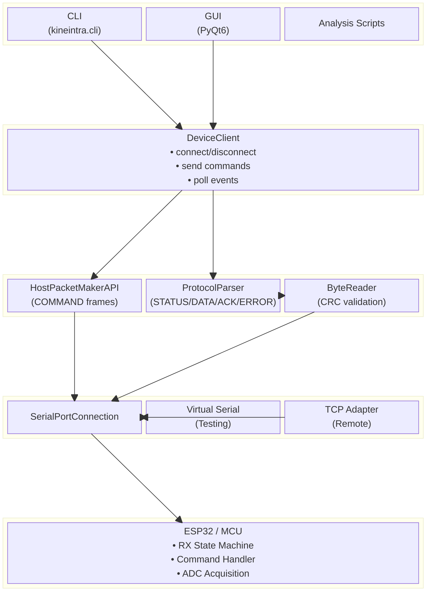
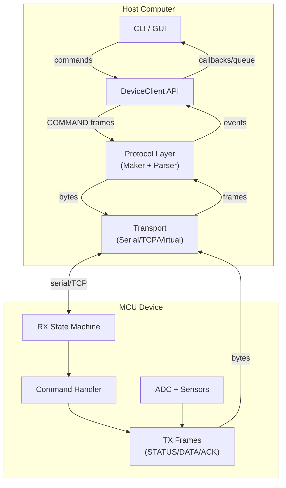
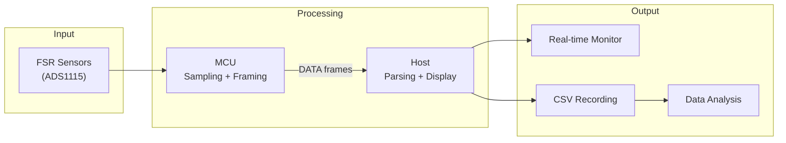

# Block Diagram

High-level system architecture showing major components and their relationships.

## System Block Diagram

```mermaid
block-beta
    columns 3
    
    block:USER["User Layer"]:3
        CLI["CLI\n(kineintra.cli)"]
        GUI["GUI\n(PyQt6)"]
        Scripts["Analysis Scripts"]
    end
    
    space:3
    
    block:API["Host API Layer"]:3
        DeviceClient["DeviceClient\n• connect/disconnect\n• send commands\n• poll events"]
    end
    
    space:3
    
    block:PROTOCOL["Protocol Layer"]:3
        HostPacketMaker["HostPacketMakerAPI\n(COMMAND frames)"]
        ProtocolParser["ProtocolParser\n(STATUS/DATA/ACK/ERROR)"]
        ByteReader["ByteReader\n(CRC validation)"]
    end
    
    space:3
    
    block:TRANSPORT["Transport Layer"]:3
        SerialConn["SerialPortConnection"]
        VirtualSerial["Virtual Serial\n(Testing)"]
        TCPBridge["TCP Adapter\n(Remote)"]
    end
    
    space:3
    
    block:DEVICE["Device Layer"]:3
        MCU["ESP32 / MCU\n• RX State Machine\n• Command Handler\n• ADC Acquisition"]
    end
    
    CLI --> DeviceClient
    GUI --> DeviceClient
    DeviceClient --> HostPacketMaker
    DeviceClient --> ProtocolParser
    ProtocolParser --> ByteReader
    HostPacketMaker --> SerialConn
    ByteReader --> SerialConn
    SerialConn --> MCU
    VirtualSerial --> SerialConn
    TCPBridge --> SerialConn
```

## Simplified Flow Diagram

```mermaid
flowchart TB
    subgraph Host["Host Computer"]
        direction TB
        UI["CLI / GUI"]
        API["DeviceClient API"]
        PROTO["Protocol Layer\n(Maker + Parser)"]
        TRANS["Transport\n(Serial/TCP/Virtual)"]
    end
    
    subgraph Device["MCU Device"]
        direction TB
        RX["RX State Machine"]
        CMD["Command Handler"]
        TX["TX Frames\n(STATUS/DATA/ACK)"]
        ADC["ADC + Sensors"]
    end
    
    UI -->|"commands"| API
    API -->|"COMMAND frames"| PROTO
    PROTO -->|"bytes"| TRANS
    TRANS <-->|"serial/TCP"| RX
    RX --> CMD
    CMD --> TX
    ADC --> TX
    TX -->|"bytes"| TRANS
    TRANS -->|"frames"| PROTO
    PROTO -->|"events"| API
    API -->|"callbacks/queue"| UI
```

## Data Flow Block

```mermaid
flowchart LR
    subgraph INPUT["Input"]
        SENSORS["FSR Sensors\n(ADS1115)"]
    end
    
    subgraph PROCESS["Processing"]
        MCU["MCU\nSampling + Framing"]
        HOST["Host\nParsing + Display"]
    end
    
    subgraph OUTPUT["Output"]
        DISPLAY["Real-time Monitor"]
        CSV["CSV Recording"]
        ANALYSIS["Data Analysis"]
    end
    
    SENSORS --> MCU
    MCU -->|"DATA frames"| HOST
    HOST --> DISPLAY
    HOST --> CSV
    CSV --> ANALYSIS
```
