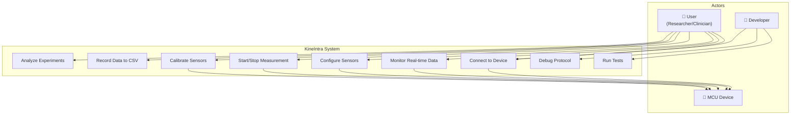
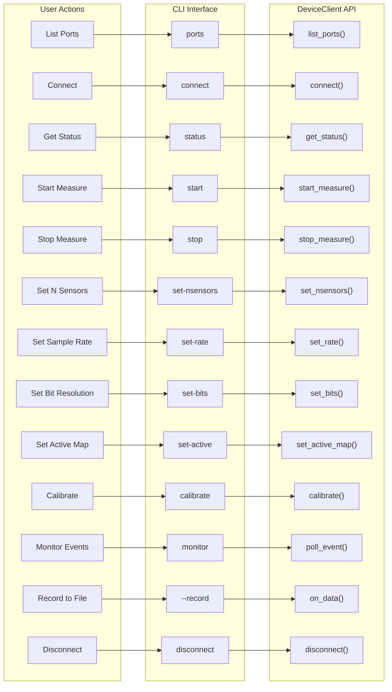
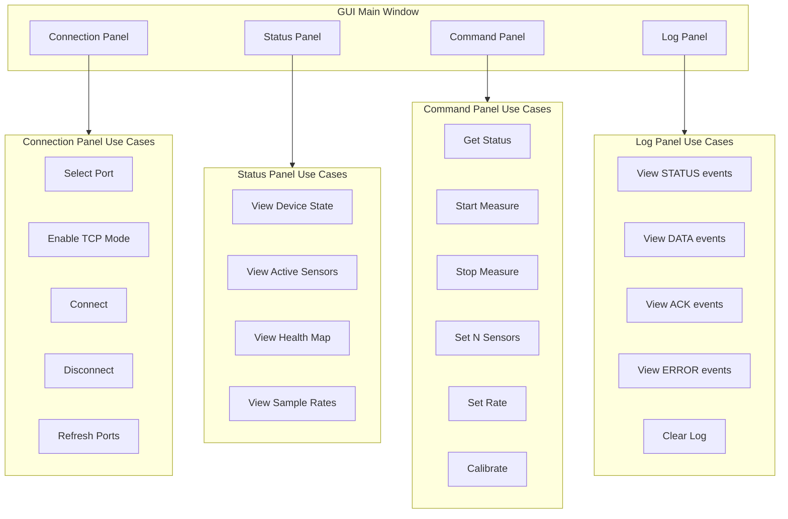

# Use Case Diagram

Actors and their interactions with the system.

## Primary Use Cases

```mermaid
flowchart TB
    subgraph Actors
        USER["👤 User\n(Researcher/Clinician)"]
        DEV["🔧 Developer"]
        MCU["🔌 MCU Device"]
    end
    
    subgraph System["KineIntra System"]
        UC1["Connect to Device"]
        UC2["Monitor Real-time Data"]
        UC3["Configure Sensors"]
        UC4["Start/Stop Measurement"]
        UC5["Calibrate Sensors"]
        UC6["Record Data to CSV"]
        UC7["Analyze Experiments"]
        UC8["Run Tests"]
        UC9["Debug Protocol"]
    end
    
    USER --> UC1
    USER --> UC2
    USER --> UC3
    USER --> UC4
    USER --> UC5
    USER --> UC6
    USER --> UC7
    
    DEV --> UC8
    DEV --> UC9
    DEV --> UC1
    
    UC1 --> MCU
    UC2 --> MCU
    UC3 --> MCU
    UC4 --> MCU
    UC5 --> MCU
```

## Detailed Use Case Diagram

```mermaid
flowchart LR
    subgraph User["User Actions"]
        direction TB
        U1["List Ports"]
        U2["Connect"]
        U3["Get Status"]
        U4["Start Measure"]
        U5["Stop Measure"]
        U6["Set N Sensors"]
        U7["Set Sample Rate"]
        U8["Set Bit Resolution"]
        U9["Set Active Map"]
        U10["Calibrate"]
        U11["Monitor Events"]
        U12["Record to File"]
        U13["Disconnect"]
    end
    
    subgraph CLI["CLI Interface"]
        C1["ports"]
        C2["connect"]
        C3["status"]
        C4["start"]
        C5["stop"]
        C6["set-nsensors"]
        C7["set-rate"]
        C8["set-bits"]
        C9["set-active"]
        C10["calibrate"]
        C11["monitor"]
        C12["--record"]
        C13["disconnect"]
    end
    
    subgraph API["DeviceClient API"]
        A1["list_ports()"]
        A2["connect()"]
        A3["get_status()"]
        A4["start_measure()"]
        A5["stop_measure()"]
        A6["set_nsensors()"]
        A7["set_rate()"]
        A8["set_bits()"]
        A9["set_active_map()"]
        A10["calibrate()"]
        A11["poll_event()"]
        A12["on_data()"]
        A13["disconnect()"]
    end
    
    U1 --> C1 --> A1
    U2 --> C2 --> A2
    U3 --> C3 --> A3
    U4 --> C4 --> A4
    U5 --> C5 --> A5
    U6 --> C6 --> A6
    U7 --> C7 --> A7
    U8 --> C8 --> A8
    U9 --> C9 --> A9
    U10 --> C10 --> A10
    U11 --> C11 --> A11
    U12 --> C12 --> A12
    U13 --> C13 --> A13
```

## GUI Use Cases

```mermaid
flowchart TB
    subgraph GUI["GUI Main Window"]
        CP["Connection Panel"]
        SP["Status Panel"]
        CMP["Command Panel"]
        LP["Log Panel"]
    end
    
    subgraph ConnectionPanel["Connection Panel Use Cases"]
        CP1["Select Port"]
        CP2["Enable TCP Mode"]
        CP3["Connect"]
        CP4["Disconnect"]
        CP5["Refresh Ports"]
    end
    
    subgraph StatusPanel["Status Panel Use Cases"]
        SP1["View Device State"]
        SP2["View Active Sensors"]
        SP3["View Health Map"]
        SP4["View Sample Rates"]
    end
    
    subgraph CommandPanel["Command Panel Use Cases"]
        CMP1["Get Status"]
        CMP2["Start Measure"]
        CMP3["Stop Measure"]
        CMP4["Set N Sensors"]
        CMP5["Set Rate"]
        CMP6["Calibrate"]
    end
    
    subgraph LogPanel["Log Panel Use Cases"]
        LP1["View STATUS events"]
        LP2["View DATA events"]
        LP3["View ACK events"]
        LP4["View ERROR events"]
        LP5["Clear Log"]
    end
    
    CP --> ConnectionPanel
    SP --> StatusPanel
    CMP --> CommandPanel
    LP --> LogPanel
```
