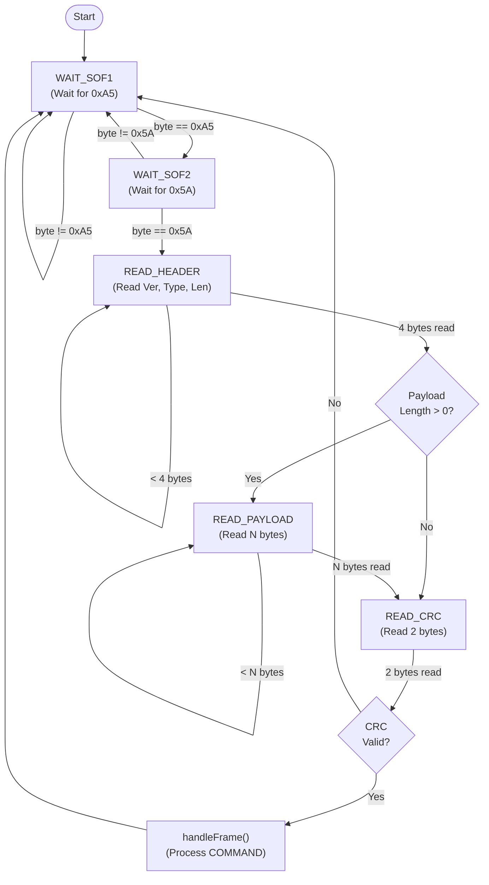
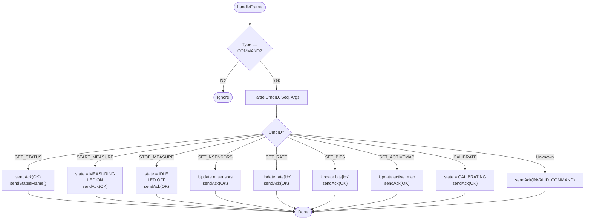
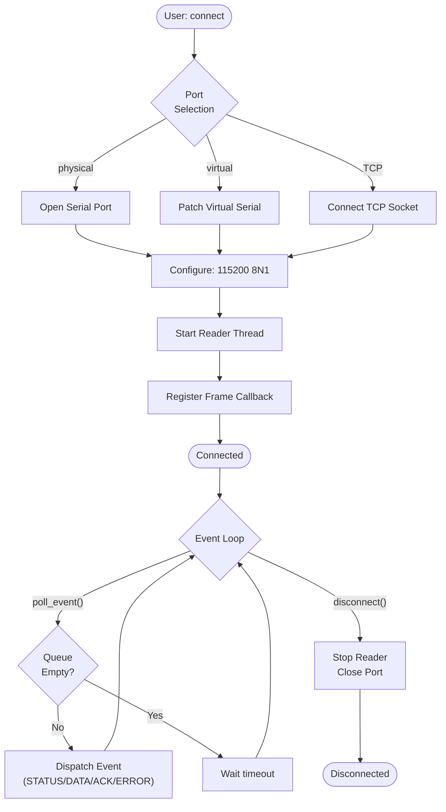
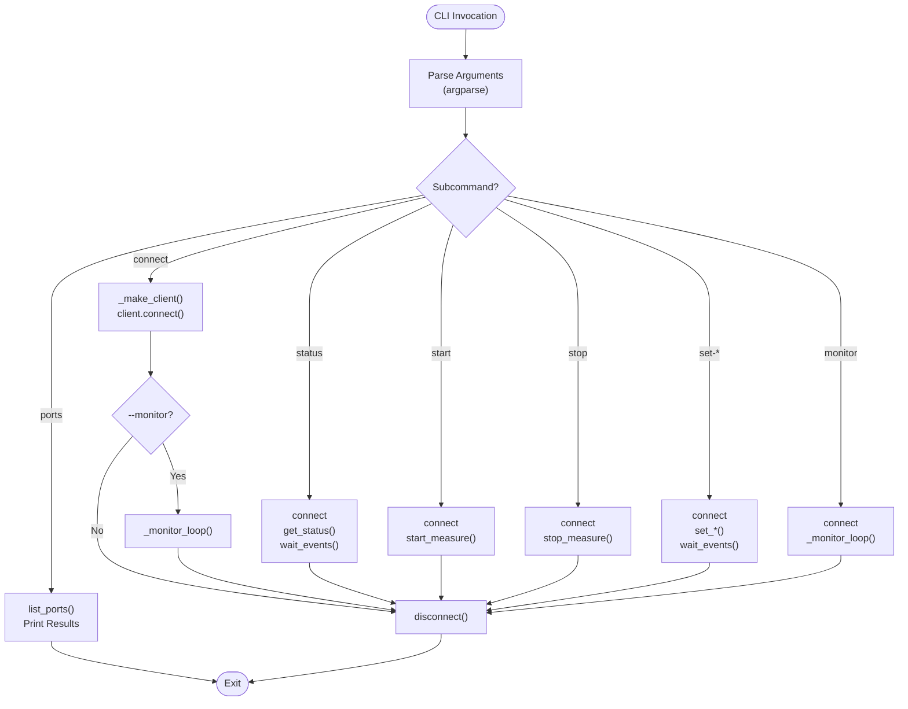
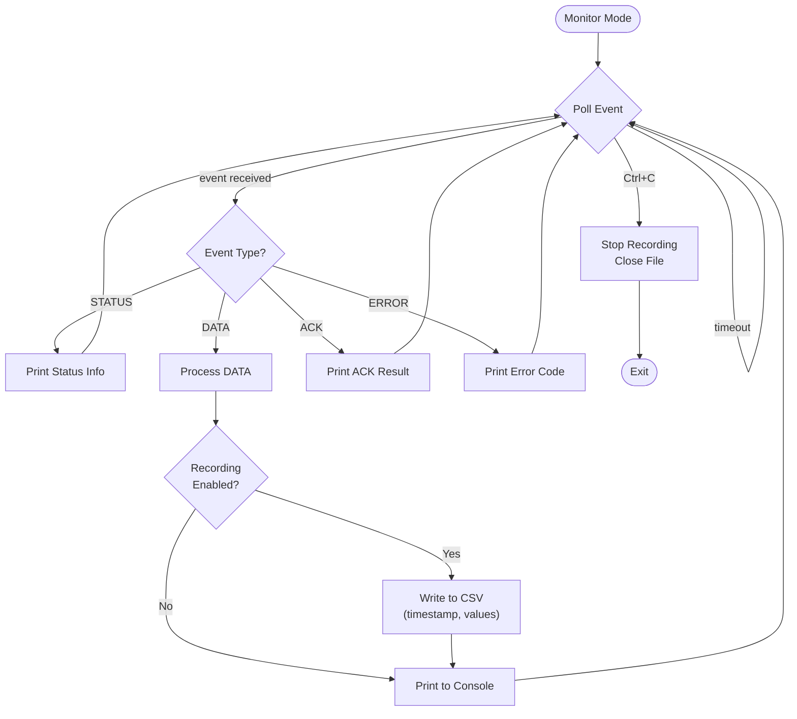

# Flowcharts

Control flow diagrams for key system processes.

## MCU RX State Machine

```mermaid
flowchart TD
    START([Start]) --> WAIT_SOF1
    
    WAIT_SOF1["WAIT_SOF1\n(Wait for 0xA5)"]
    WAIT_SOF1 -->|"byte == 0xA5"| WAIT_SOF2
    WAIT_SOF1 -->|"byte != 0xA5"| WAIT_SOF1
    
    WAIT_SOF2["WAIT_SOF2\n(Wait for 0x5A)"]
    WAIT_SOF2 -->|"byte == 0x5A"| READ_HEADER
    WAIT_SOF2 -->|"byte != 0x5A"| WAIT_SOF1
    
    READ_HEADER["READ_HEADER\n(Read Ver, Type, Len)"]
    READ_HEADER -->|"4 bytes read"| CHECK_PAYLOAD
    READ_HEADER -->|"< 4 bytes"| READ_HEADER
    
    CHECK_PAYLOAD{"Payload\nLength > 0?"}
    CHECK_PAYLOAD -->|"Yes"| READ_PAYLOAD
    CHECK_PAYLOAD -->|"No"| READ_CRC
    
    READ_PAYLOAD["READ_PAYLOAD\n(Read N bytes)"]
    READ_PAYLOAD -->|"N bytes read"| READ_CRC
    READ_PAYLOAD -->|"< N bytes"| READ_PAYLOAD
    
    READ_CRC["READ_CRC\n(Read 2 bytes)"]
    READ_CRC -->|"2 bytes read"| VERIFY_CRC
    
    VERIFY_CRC{"CRC\nValid?"}
    VERIFY_CRC -->|"Yes"| HANDLE_FRAME
    VERIFY_CRC -->|"No"| WAIT_SOF1
    
    HANDLE_FRAME["handleFrame()\n(Process COMMAND)"]
    HANDLE_FRAME --> WAIT_SOF1
```

## MCU Command Handler

```mermaid
flowchart TD
    START([handleFrame]) --> CHECK_TYPE{"Type ==\nCOMMAND?"}
    
    CHECK_TYPE -->|"No"| IGNORE([Ignore])
    CHECK_TYPE -->|"Yes"| PARSE["Parse CmdID, Seq, Args"]
    
    PARSE --> SWITCH{"CmdID?"}
    
    SWITCH -->|"GET_STATUS"| GS["sendAck(OK)\nsendStatusFrame()"]
    SWITCH -->|"START_MEASURE"| SM["state = MEASURING\nLED ON\nsendAck(OK)"]
    SWITCH -->|"STOP_MEASURE"| STOP["state = IDLE\nLED OFF\nsendAck(OK)"]
    SWITCH -->|"SET_NSENSORS"| SN["Update n_sensors\nsendAck(OK)"]
    SWITCH -->|"SET_RATE"| SR["Update rate[idx]\nsendAck(OK)"]
    SWITCH -->|"SET_BITS"| SB["Update bits[idx]\nsendAck(OK)"]
    SWITCH -->|"SET_ACTIVEMAP"| SA["Update active_map\nsendAck(OK)"]
    SWITCH -->|"CALIBRATE"| CAL["state = CALIBRATING\nsendAck(OK)"]
    SWITCH -->|"Unknown"| UNK["sendAck(INVALID_COMMAND)"]
    
    GS --> END([Done])
    SM --> END
    STOP --> END
    SN --> END
    SR --> END
    SB --> END
    SA --> END
    CAL --> END
    UNK --> END
```

## Host Connection Flow

```mermaid
flowchart TD
    START([User: connect]) --> SELECT{"Port\nSelection"}
    
    SELECT -->|"physical"| PHYS["Open Serial Port"]
    SELECT -->|"virtual"| VIRT["Patch Virtual Serial"]
    SELECT -->|"TCP"| TCP["Connect TCP Socket"]
    
    PHYS --> CONFIG["Configure: 115200 8N1"]
    VIRT --> CONFIG
    TCP --> CONFIG
    
    CONFIG --> START_READER["Start Reader Thread"]
    START_READER --> REGISTER["Register Frame Callback"]
    REGISTER --> CONNECTED([Connected])
    
    CONNECTED --> LOOP{"Event Loop"}
    
    LOOP -->|"poll_event()"| CHECK_QUEUE{"Queue\nEmpty?"}
    CHECK_QUEUE -->|"No"| DISPATCH["Dispatch Event\n(STATUS/DATA/ACK/ERROR)"]
    CHECK_QUEUE -->|"Yes"| WAIT["Wait timeout"]
    
    DISPATCH --> LOOP
    WAIT --> LOOP
    
    LOOP -->|"disconnect()"| CLEANUP["Stop Reader\nClose Port"]
    CLEANUP --> END([Disconnected])
```

## CLI Command Flow

```mermaid
flowchart TD
    START([CLI Invocation]) --> PARSE["Parse Arguments\n(argparse)"]
    
    PARSE --> ROUTE{"Subcommand?"}
    
    ROUTE -->|"ports"| PORTS["list_ports()\nPrint Results"]
    ROUTE -->|"connect"| CONNECT["_make_client()\nclient.connect()"]
    ROUTE -->|"status"| STATUS["connect\nget_status()\nwait_events()"]
    ROUTE -->|"start"| START_M["connect\nstart_measure()"]
    ROUTE -->|"stop"| STOP_M["connect\nstop_measure()"]
    ROUTE -->|"set-*"| SET_CMD["connect\nset_*()\nwait_events()"]
    ROUTE -->|"monitor"| MONITOR["connect\n_monitor_loop()"]
    
    PORTS --> EXIT([Exit])
    
    CONNECT --> MON_CHECK{"--monitor?"}
    MON_CHECK -->|"Yes"| MON_LOOP["_monitor_loop()"]
    MON_CHECK -->|"No"| DISC["disconnect()"]
    
    MON_LOOP --> DISC
    STATUS --> DISC
    START_M --> DISC
    STOP_M --> DISC
    SET_CMD --> DISC
    MONITOR --> DISC
    
    DISC --> EXIT
```

## Data Recording Flow

```mermaid
flowchart TD
    START([Monitor Mode]) --> LOOP{"Poll Event"}
    
    LOOP -->|"timeout"| LOOP
    LOOP -->|"event received"| CHECK{"Event Type?"}
    
    CHECK -->|"STATUS"| PRINT_STATUS["Print Status Info"]
    CHECK -->|"DATA"| PROC_DATA["Process DATA"]
    CHECK -->|"ACK"| PRINT_ACK["Print ACK Result"]
    CHECK -->|"ERROR"| PRINT_ERR["Print Error Code"]
    
    PROC_DATA --> REC_CHECK{"Recording\nEnabled?"}
    REC_CHECK -->|"No"| PRINT_DATA["Print to Console"]
    REC_CHECK -->|"Yes"| WRITE_CSV["Write to CSV\n(timestamp, values)"]
    
    WRITE_CSV --> PRINT_DATA
    
    PRINT_STATUS --> LOOP
    PRINT_DATA --> LOOP
    PRINT_ACK --> LOOP
    PRINT_ERR --> LOOP
    
    LOOP -->|"Ctrl+C"| STOP["Stop Recording\nClose File"]
    STOP --> END([Exit])
```
