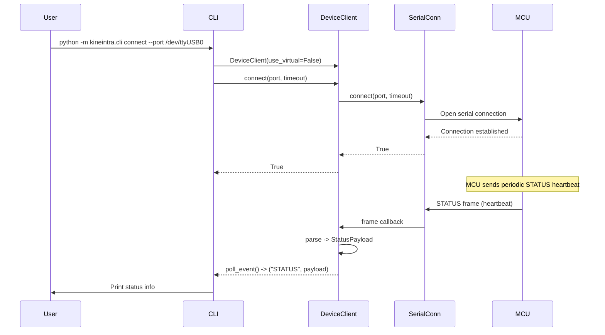
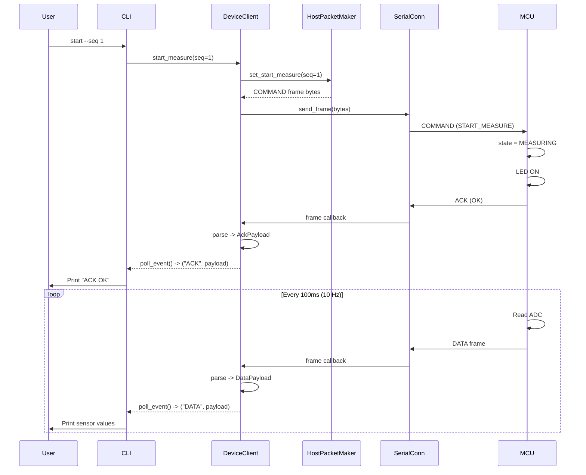
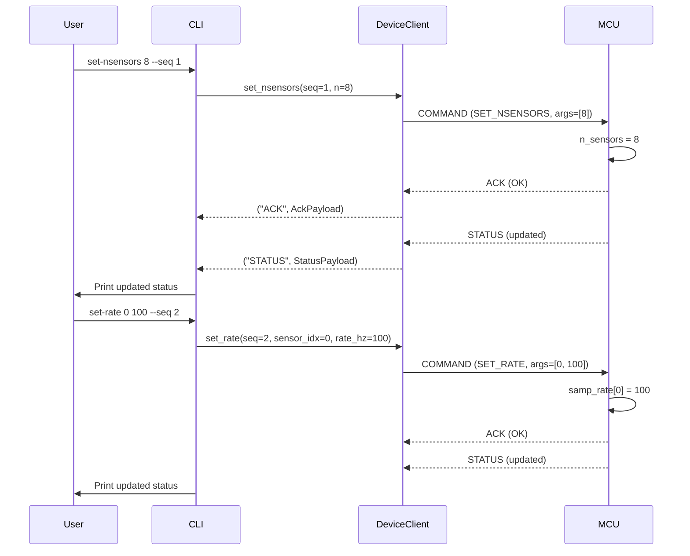
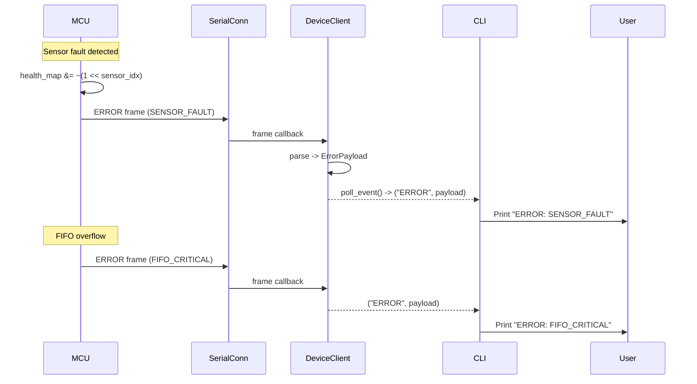
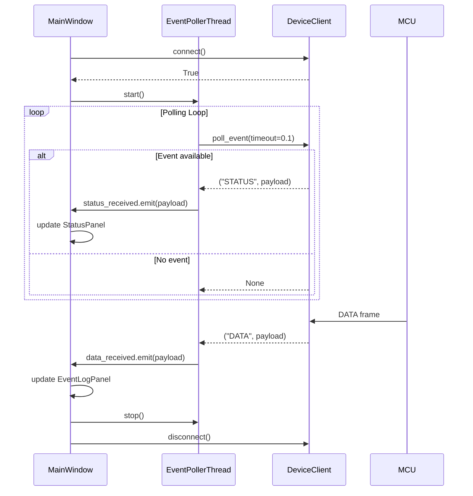
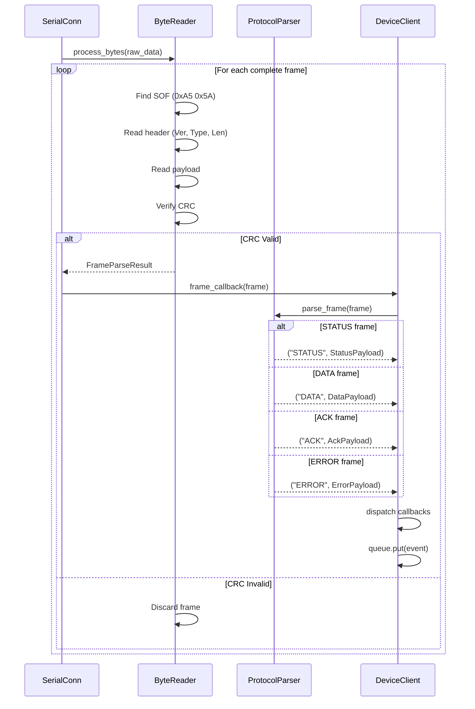
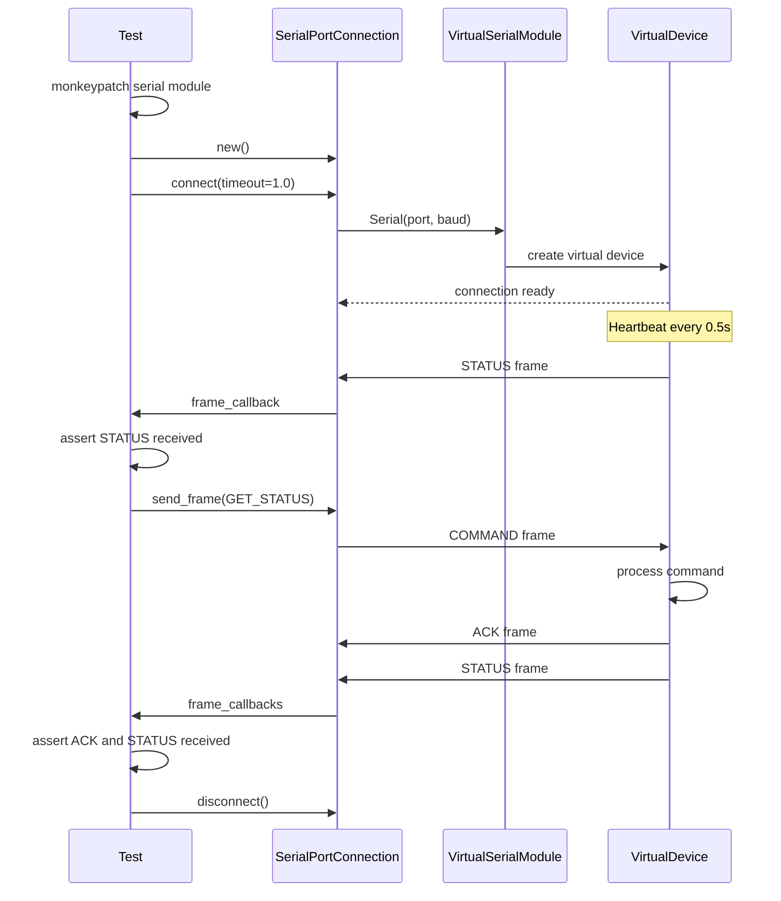

# Sequence Diagrams

Message sequence diagrams showing interactions between components.

## Connection and Status Request

## Start Measurement Sequence

## Configuration Sequence

## Error Handling Sequence

## GUI Event Polling

## Protocol Parser Flow

## Virtual Serial Test Sequence

