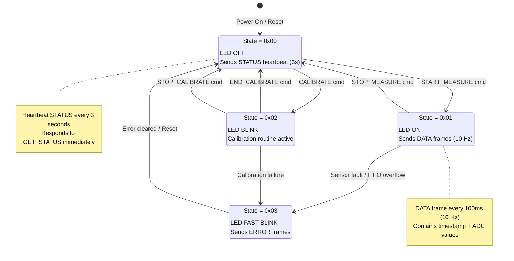
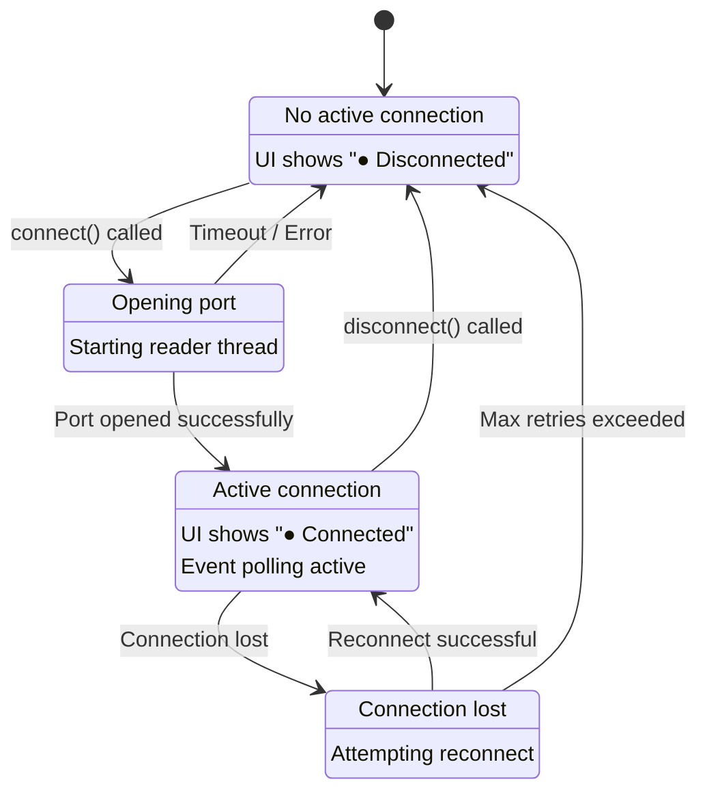
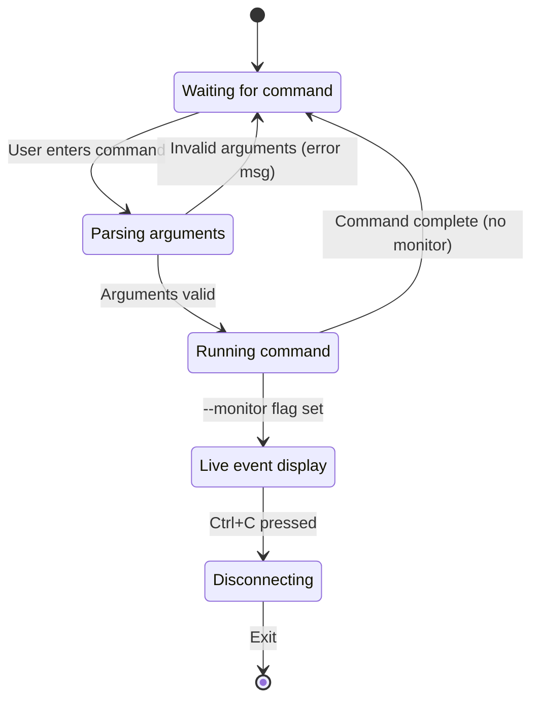
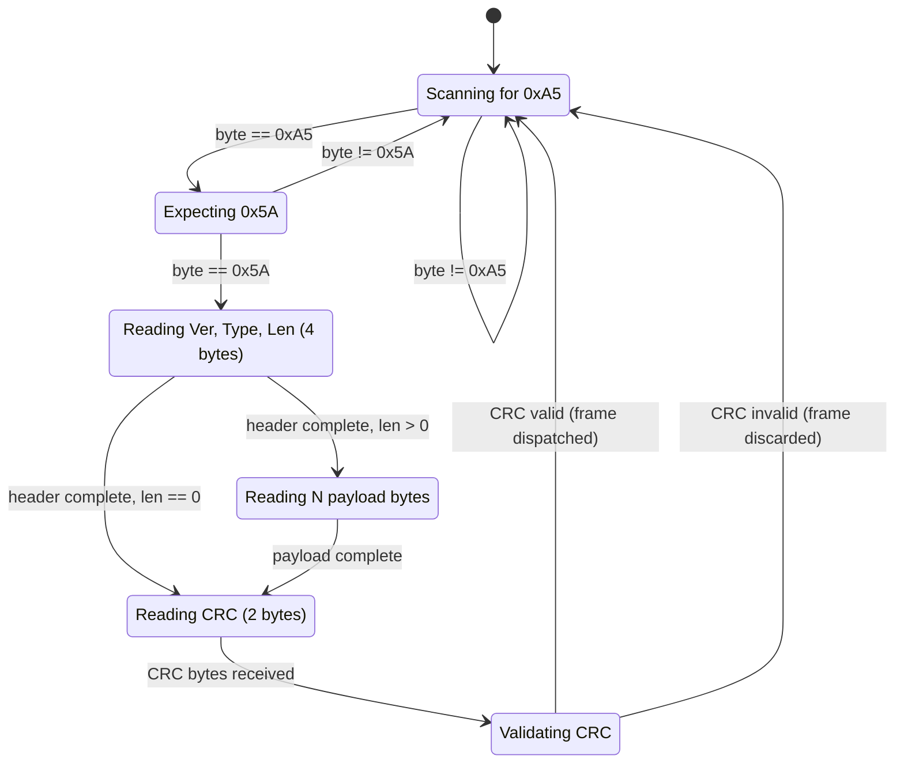
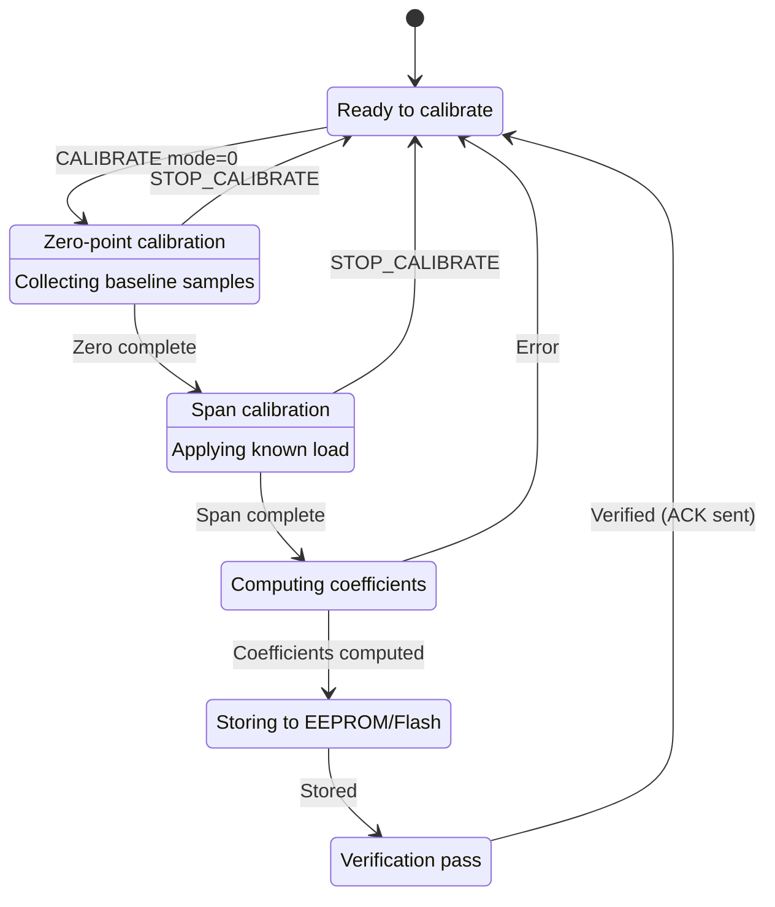

# State Diagram

Device state machine and transitions.

## MCU Device States

```mermaid
stateDiagram-v2
    [*] --> IDLE: Power On / Reset
    
    IDLE: State = 0x00
    IDLE: LED OFF
    IDLE: Sends STATUS heartbeat (3s)
    
    MEASURING: State = 0x01
    MEASURING: LED ON
    MEASURING: Sends DATA frames (10 Hz)
    
    CALIBRATING: State = 0x02
    CALIBRATING: LED BLINK
    CALIBRATING: Calibration routine active
    
    ERROR_STATE: State = 0x03
    ERROR_STATE: LED FAST BLINK
    ERROR_STATE: Sends ERROR frames
    
    IDLE --> MEASURING: START_MEASURE cmd
    MEASURING --> IDLE: STOP_MEASURE cmd
    
    IDLE --> CALIBRATING: CALIBRATE cmd
    CALIBRATING --> IDLE: END_CALIBRATE cmd
    CALIBRATING --> IDLE: STOP_CALIBRATE cmd
    
    MEASURING --> ERROR_STATE: Sensor fault / FIFO overflow
    CALIBRATING --> ERROR_STATE: Calibration failure
    ERROR_STATE --> IDLE: Error cleared / Reset
    
    note right of IDLE
        Heartbeat STATUS every 3 seconds
        Responds to GET_STATUS immediately
    end note
    
    note right of MEASURING
        DATA frame every 100ms (10 Hz)
        Contains timestamp + ADC values
    end note
```

## Host Connection States

```mermaid
stateDiagram-v2
    [*] --> Disconnected
    
    Disconnected: No active connection
    Disconnected: UI shows "● Disconnected"
    
    Connecting: Opening port
    Connecting: Starting reader thread
    
    Connected: Active connection
    Connected: UI shows "● Connected"
    Connected: Event polling active
    
    Reconnecting: Connection lost
    Reconnecting: Attempting reconnect
    
    Disconnected --> Connecting: connect() called
    Connecting --> Connected: Port opened successfully
    Connecting --> Disconnected: Timeout / Error
    
    Connected --> Disconnected: disconnect() called
    Connected --> Reconnecting: Connection lost
    
    Reconnecting --> Connected: Reconnect successful
    Reconnecting --> Disconnected: Max retries exceeded
```

## CLI Session States

```mermaid
stateDiagram-v2
    [*] --> Idle
    
    Idle: Waiting for command
    
    Parsing: Parsing arguments
    
    Executing: Running command
    
    Monitoring: Live event display
    
    Cleanup: Disconnecting
    
    Idle --> Parsing: User enters command
    Parsing --> Executing: Arguments valid
    Parsing --> Idle: Invalid arguments (error msg)
    
    Executing --> Idle: Command complete (no monitor)
    Executing --> Monitoring: --monitor flag set
    
    Monitoring --> Cleanup: Ctrl+C pressed
    Cleanup --> [*]: Exit
```

## Frame Processing States

```mermaid
stateDiagram-v2
    [*] --> WAIT_SOF1
    
    WAIT_SOF1: Scanning for 0xA5
    WAIT_SOF2: Expecting 0x5A
    READ_HEADER: Reading Ver, Type, Len (4 bytes)
    READ_PAYLOAD: Reading N payload bytes
    READ_CRC: Reading CRC (2 bytes)
    VERIFY: Validating CRC
    
    WAIT_SOF1 --> WAIT_SOF2: byte == 0xA5
    WAIT_SOF1 --> WAIT_SOF1: byte != 0xA5
    
    WAIT_SOF2 --> READ_HEADER: byte == 0x5A
    WAIT_SOF2 --> WAIT_SOF1: byte != 0x5A
    
    READ_HEADER --> READ_PAYLOAD: header complete, len > 0
    READ_HEADER --> READ_CRC: header complete, len == 0
    
    READ_PAYLOAD --> READ_CRC: payload complete
    
    READ_CRC --> VERIFY: CRC bytes received
    
    VERIFY --> WAIT_SOF1: CRC valid (frame dispatched)
    VERIFY --> WAIT_SOF1: CRC invalid (frame discarded)
```

## Calibration Sub-States

```mermaid
stateDiagram-v2
    [*] --> CAL_IDLE
    
    CAL_IDLE: Ready to calibrate
    
    CAL_ZERO: Zero-point calibration
    CAL_ZERO: Collecting baseline samples
    
    CAL_SPAN: Span calibration
    CAL_SPAN: Applying known load
    
    CAL_COMPUTE: Computing coefficients
    
    CAL_STORE: Storing to EEPROM/Flash
    
    CAL_VERIFY: Verification pass
    
    CAL_IDLE --> CAL_ZERO: CALIBRATE mode=0
    CAL_ZERO --> CAL_SPAN: Zero complete
    CAL_SPAN --> CAL_COMPUTE: Span complete
    CAL_COMPUTE --> CAL_STORE: Coefficients computed
    CAL_STORE --> CAL_VERIFY: Stored
    CAL_VERIFY --> CAL_IDLE: Verified (ACK sent)
    
    CAL_ZERO --> CAL_IDLE: STOP_CALIBRATE
    CAL_SPAN --> CAL_IDLE: STOP_CALIBRATE
    CAL_COMPUTE --> CAL_IDLE: Error
```
