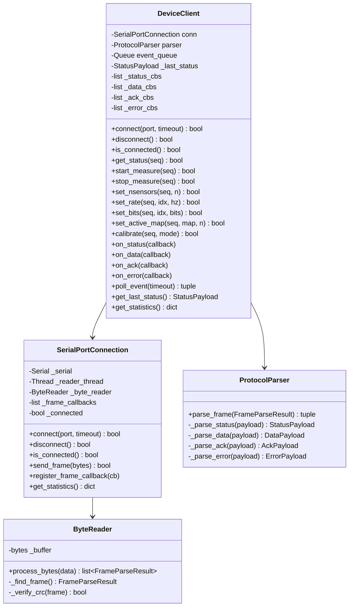
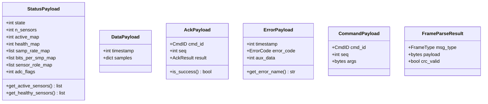
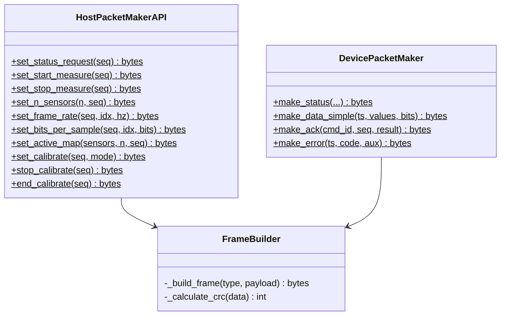
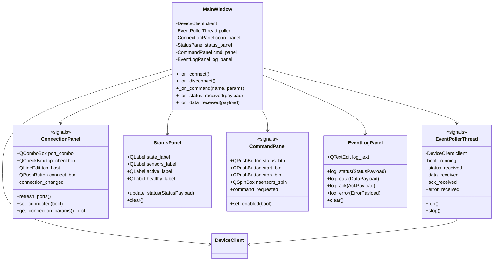
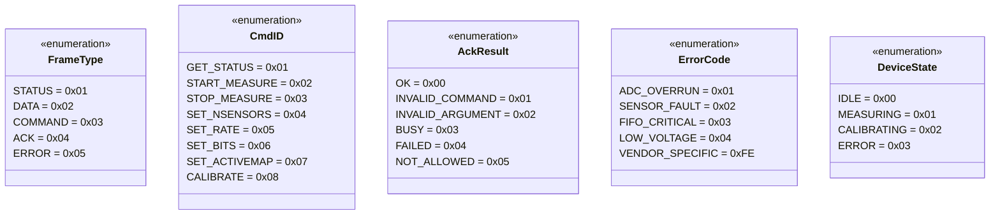

# Class Diagram

Host software class structure and relationships.

## Core API Classes

```mermaid
classDiagram
    class DeviceClient {
        -SerialPortConnection conn
        -ProtocolParser parser
        -Queue event_queue
        -StatusPayload _last_status
        -list _status_cbs
        -list _data_cbs
        -list _ack_cbs
        -list _error_cbs
        +connect(port, timeout) bool
        +disconnect() bool
        +is_connected() bool
        +get_status(seq) bool
        +start_measure(seq) bool
        +stop_measure(seq) bool
        +set_nsensors(seq, n) bool
        +set_rate(seq, idx, hz) bool
        +set_bits(seq, idx, bits) bool
        +set_active_map(seq, map, n) bool
        +calibrate(seq, mode) bool
        +on_status(callback)
        +on_data(callback)
        +on_ack(callback)
        +on_error(callback)
        +poll_event(timeout) tuple
        +get_last_status() StatusPayload
        +get_statistics() dict
    }
    
    class SerialPortConnection {
        -Serial _serial
        -Thread _reader_thread
        -ByteReader _byte_reader
        -list _frame_callbacks
        -bool _connected
        +connect(port, timeout) bool
        +disconnect() bool
        +is_connected() bool
        +send_frame(bytes) bool
        +register_frame_callback(cb)
        +get_statistics() dict
    }
    
    class ProtocolParser {
        +parse_frame(FrameParseResult) tuple
        -_parse_status(payload) StatusPayload
        -_parse_data(payload) DataPayload
        -_parse_ack(payload) AckPayload
        -_parse_error(payload) ErrorPayload
    }
    
    class ByteReader {
        -bytes _buffer
        +process_bytes(data) list~FrameParseResult~
        -_find_frame() FrameParseResult
        -_verify_crc(frame) bool
    }
    
    DeviceClient --> SerialPortConnection
    DeviceClient --> ProtocolParser
    SerialPortConnection --> ByteReader
```

## Payload Classes

```mermaid
classDiagram
    class StatusPayload {
        +int state
        +int n_sensors
        +int active_map
        +int health_map
        +list samp_rate_map
        +list bits_per_smp_map
        +list sensor_role_map
        +int adc_flags
        +get_active_sensors() list
        +get_healthy_sensors() list
    }
    
    class DataPayload {
        +int timestamp
        +dict samples
    }
    
    class AckPayload {
        +CmdID cmd_id
        +int seq
        +AckResult result
        +is_success() bool
    }
    
    class ErrorPayload {
        +int timestamp
        +ErrorCode error_code
        +int aux_data
        +get_error_name() str
    }
    
    class CommandPayload {
        +CmdID cmd_id
        +int seq
        +bytes args
    }
    
    class FrameParseResult {
        +FrameType msg_type
        +bytes payload
        +bool crc_valid
    }
```

## Packet Maker Classes

```mermaid
classDiagram
    class HostPacketMakerAPI {
        +set_status_request(seq) bytes$
        +set_start_measure(seq) bytes$
        +set_stop_measure(seq) bytes$
        +set_n_sensors(n, seq) bytes$
        +set_frame_rate(seq, idx, hz) bytes$
        +set_bits_per_sample(seq, idx, bits) bytes$
        +set_active_map(sensors, n, seq) bytes$
        +set_calibrate(seq, mode) bytes$
        +stop_calibrate(seq) bytes$
        +end_calibrate(seq) bytes$
    }
    
    class DevicePacketMaker {
        +make_status(...) bytes$
        +make_data_simple(ts, values, bits) bytes$
        +make_ack(cmd_id, seq, result) bytes$
        +make_error(ts, code, aux) bytes$
    }
    
    class FrameBuilder {
        -_build_frame(type, payload) bytes
        -_calculate_crc(data) int
    }
    
    HostPacketMakerAPI --> FrameBuilder
    DevicePacketMaker --> FrameBuilder
```

## GUI Classes

```mermaid
classDiagram
    class MainWindow {
        -DeviceClient client
        -EventPollerThread poller
        -ConnectionPanel conn_panel
        -StatusPanel status_panel
        -CommandPanel cmd_panel
        -EventLogPanel log_panel
        +_on_connect()
        +_on_disconnect()
        +_on_command(name, params)
        +_on_status_received(payload)
        +_on_data_received(payload)
    }
    
    class EventPollerThread {
        -DeviceClient client
        -bool _running
        +run()
        +stop()
        <<signals>>
        +status_received
        +data_received
        +ack_received
        +error_received
    }
    
    class ConnectionPanel {
        +QComboBox port_combo
        +QCheckBox tcp_checkbox
        +QLineEdit tcp_host
        +QPushButton connect_btn
        +refresh_ports()
        +set_connected(bool)
        +get_connection_params() dict
        <<signals>>
        +connection_changed
    }
    
    class StatusPanel {
        +QLabel state_label
        +QLabel sensors_label
        +QLabel active_label
        +QLabel healthy_label
        +update_status(StatusPayload)
        +clear()
    }
    
    class CommandPanel {
        +QPushButton status_btn
        +QPushButton start_btn
        +QPushButton stop_btn
        +QSpinBox nsensors_spin
        +set_enabled(bool)
        <<signals>>
        +command_requested
    }
    
    class EventLogPanel {
        +QTextEdit log_text
        +log_status(StatusPayload)
        +log_data(DataPayload)
        +log_ack(AckPayload)
        +log_error(ErrorPayload)
        +clear()
    }
    
    MainWindow --> DeviceClient
    MainWindow --> EventPollerThread
    MainWindow --> ConnectionPanel
    MainWindow --> StatusPanel
    MainWindow --> CommandPanel
    MainWindow --> EventLogPanel
    EventPollerThread --> DeviceClient
```

## Enums and Constants

```mermaid
classDiagram
    class FrameType {
        <<enumeration>>
        STATUS = 0x01
        DATA = 0x02
        COMMAND = 0x03
        ACK = 0x04
        ERROR = 0x05
    }
    
    class CmdID {
        <<enumeration>>
        GET_STATUS = 0x01
        START_MEASURE = 0x02
        STOP_MEASURE = 0x03
        SET_NSENSORS = 0x04
        SET_RATE = 0x05
        SET_BITS = 0x06
        SET_ACTIVEMAP = 0x07
        CALIBRATE = 0x08
    }
    
    class AckResult {
        <<enumeration>>
        OK = 0x00
        INVALID_COMMAND = 0x01
        INVALID_ARGUMENT = 0x02
        BUSY = 0x03
        FAILED = 0x04
        NOT_ALLOWED = 0x05
    }
    
    class ErrorCode {
        <<enumeration>>
        ADC_OVERRUN = 0x01
        SENSOR_FAULT = 0x02
        FIFO_CRITICAL = 0x03
        LOW_VOLTAGE = 0x04
        VENDOR_SPECIFIC = 0xFE
    }
    
    class DeviceState {
        <<enumeration>>
        IDLE = 0x00
        MEASURING = 0x01
        CALIBRATING = 0x02
        ERROR = 0x03
    }
```
