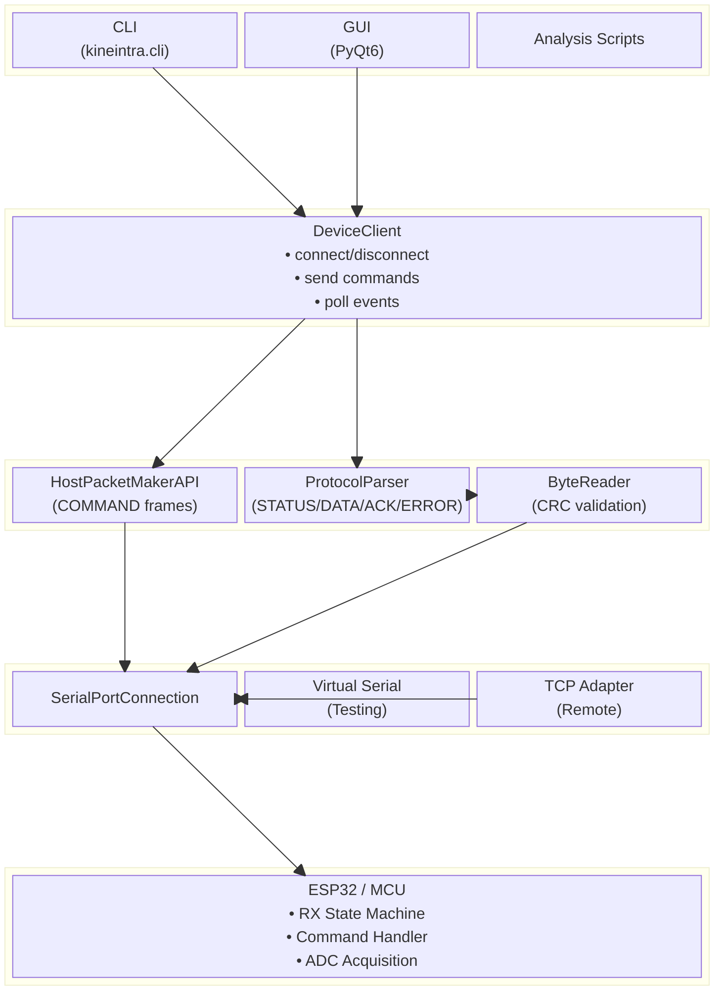
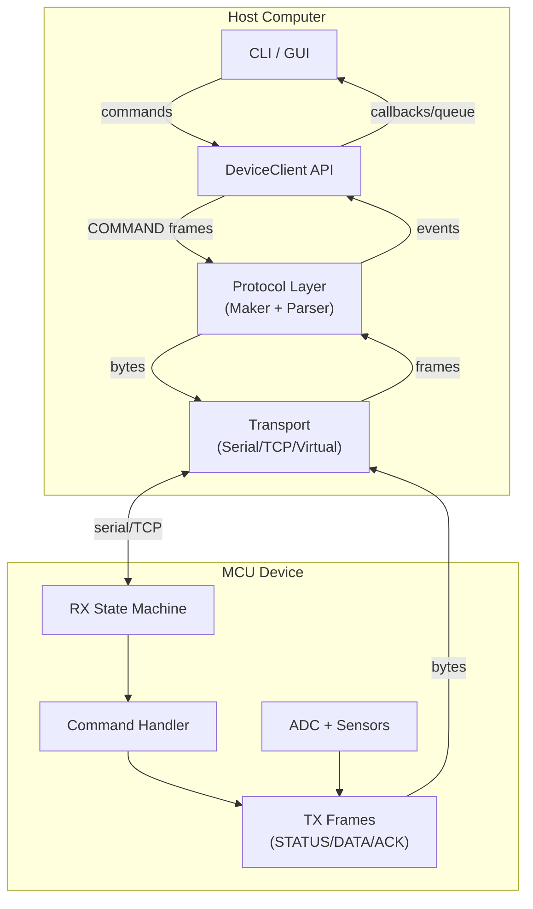
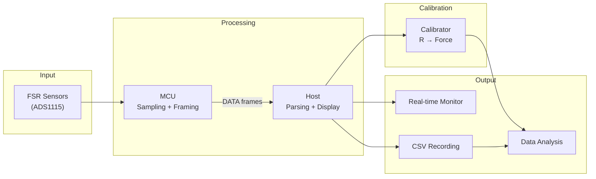

# System Overview

## 4.1 High-Level Architecture

### 4.1.1 System Components

```
┌─────────────────────────────────────────────────────────────────────────┐
│                           HOST COMPUTER                                  │
│  ┌─────────────┐  ┌─────────────┐  ┌─────────────┐  ┌─────────────┐    │
│  │     CLI     │  │     GUI     │  │   Scripts   │  │    Tests    │    │
│  │ kineintra   │  │   PyQt6     │  │  Analysis   │  │   pytest    │    │
│  └──────┬──────┘  └──────┬──────┘  └──────┬──────┘  └──────┬──────┘    │
│         │                │                │                │            │
│         └────────────────┴────────────────┴────────────────┘            │
│                                   │                                      │
│                          ┌────────▼────────┐                            │
│                          │  DeviceClient   │  ◄── Host API Layer        │
│                          │  (API Facade)   │                            │
│                          └────────┬────────┘                            │
│                                   │                                      │
│         ┌─────────────────────────┼─────────────────────────┐           │
│         │                         │                         │           │
│  ┌──────▼──────┐          ┌───────▼───────┐         ┌───────▼───────┐  │
│  │HostPacket   │          │ ProtocolParser│         │   ByteReader  │  │
│  │ MakerAPI    │          │ (frame→payload)│        │ (bytes→frame) │  │
│  └──────┬──────┘          └───────┬───────┘         └───────┬───────┘  │
│         │                         │                         │           │
│         └─────────────────────────┴─────────────────────────┘           │
│                                   │                                      │
│                          ┌────────▼────────┐                            │
│                          │SerialPortConn   │  ◄── Transport Layer       │
│                          │ (abstraction)   │                            │
│                          └────────┬────────┘                            │
│                                   │                                      │
│         ┌─────────────────────────┼─────────────────────────┐           │
│         │                         │                         │           │
│  ┌──────▼──────┐          ┌───────▼───────┐         ┌───────▼───────┐  │
│  │Physical     │          │ Virtual Serial│         │  TCP Bridge   │  │
│  │Serial Port  │          │ (testing)     │         │  (remote)     │  │
│  └──────┬──────┘          └───────┬───────┘         └───────┬───────┘  │
└─────────┼─────────────────────────┼─────────────────────────┼───────────┘
          │                         │                         │
          │                         ▼                         │
          │              ┌─────────────────────┐              │
          │              │   Virtual Device    │              │
          │              │   (test harness)    │              │
          │              └─────────────────────┘              │
          │                                                    │
          ▼                                                    ▼
┌─────────────────────────────────────────────────────────────────────────┐
│                           MCU DEVICE (ESP32)                             │
│  ┌─────────────────────────────────────────────────────────────────┐    │
│  │                        Serial Interface                          │    │
│  │                      (115200 baud, 8N1)                          │    │
│  └────────────────────────────┬────────────────────────────────────┘    │
│                               │                                          │
│  ┌────────────────────────────▼────────────────────────────────────┐    │
│  │                      RX State Machine                            │    │
│  │   WAIT_SOF1 → WAIT_SOF2 → READ_HEADER → READ_PAYLOAD → READ_CRC │    │
│  └────────────────────────────┬────────────────────────────────────┘    │
│                               │                                          │
│  ┌────────────────────────────▼────────────────────────────────────┐    │
│  │                      Command Handler                             │    │
│  │   GET_STATUS │ START │ STOP │ SET_* │ CALIBRATE                 │    │
│  └────────────────────────────┬────────────────────────────────────┘    │
│                               │                                          │
│  ┌──────────────┐     ┌───────▼───────┐     ┌──────────────────────┐    │
│  │  ADC Driver  │────►│  Device State │────►│   TX Frame Builder   │    │
│  │  (ADS1115)   │     │  (IDLE/MEAS)  │     │  (STATUS/DATA/ACK)   │    │
│  └──────────────┘     └───────────────┘     └──────────────────────┘    │
│                                                                          │
│  ┌─────────────────────────────────────────────────────────────────┐    │
│  │                      Sensor Array (FSR/Load Cells)               │    │
│  │   [S0] [S1] [S2] [S3] ... [S31]  (up to 32 channels)            │    │
│  └─────────────────────────────────────────────────────────────────┘    │
└─────────────────────────────────────────────────────────────────────────┘
```

### 4.1.2 Layer Responsibilities

| Layer | Components | Responsibility |
|-------|------------|----------------|
| **Application** | CLI, GUI, Scripts | User interaction, display, file I/O |
| **Host API** | `DeviceClient` | Connection lifecycle, command dispatch, event routing |
| **Protocol** | Makers, Parser, Reader | Frame construction, parsing, CRC validation |
| **Transport** | `SerialPortConnection` | Byte-level I/O, threading, transport abstraction |
| **Physical/Virtual** | Serial, TCP, Virtual | Actual data transmission or simulation |
| **Device** | MCU Firmware | Sensor acquisition, protocol handling, state management |

## 4.2 Data Flow Diagrams

### 4.2.1 Command Path (Host → Device)

```
User Action          CLI/GUI              DeviceClient         HostPacketMaker      Transport           MCU
    │                   │                      │                     │                  │                │
    │  "start"          │                      │                     │                  │                │
    ├──────────────────►│                      │                     │                  │                │
    │                   │  start_measure(seq)  │                     │                  │                │
    │                   ├─────────────────────►│                     │                  │                │
    │                   │                      │ set_start_measure() │                  │                │
    │                   │                      ├────────────────────►│                  │                │
    │                   │                      │                     │ COMMAND bytes    │                │
    │                   │                      │                     ├─────────────────►│                │
    │                   │                      │                     │                  │ send_frame()   │
    │                   │                      │                     │                  ├───────────────►│
    │                   │                      │                     │                  │                │
```

### 4.2.2 Response Path (Device → Host)

```
MCU                  Transport            ByteReader           ProtocolParser       DeviceClient         CLI/GUI
 │                      │                     │                     │                   │                  │
 │  STATUS/DATA bytes   │                     │                     │                   │                  │
 ├─────────────────────►│                     │                     │                   │                  │
 │                      │  process_bytes()    │                     │                   │                  │
 │                      ├────────────────────►│                     │                   │                  │
 │                      │                     │  FrameParseResult   │                   │                  │
 │                      │                     ├────────────────────►│                   │                  │
 │                      │                     │                     │  parse_frame()    │                  │
 │                      │                     │                     ├──────────────────►│                  │
 │                      │                     │                     │                   │  ("STATUS", pl)  │
 │                      │                     │                     │                   ├─────────────────►│
 │                      │                     │                     │                   │                  │
```

### 4.2.3 Event Dispatch Model

```
                    ┌─────────────────────┐
                    │    DeviceClient     │
                    └──────────┬──────────┘
                               │
           ┌───────────────────┼───────────────────┐
           │                   │                   │
           ▼                   ▼                   ▼
    ┌─────────────┐     ┌─────────────┐     ┌─────────────┐
    │  Callbacks  │     │ Event Queue │     │ Last Status │
    │ on_status() │     │ poll_event()│     │   Cache     │
    │ on_data()   │     │             │     │             │
    │ on_ack()    │     │             │     │             │
    │ on_error()  │     │             │     │             │
    └─────────────┘     └─────────────┘     └─────────────┘
           │                   │                   │
           ▼                   ▼                   ▼
    (Background            (Polling              (Synchronous
     processing)            loops)                queries)
```

## 4.3 Module Mapping

### 4.3.1 Directory Structure

```
kineintra/
├── __init__.py
├── cli.py                    # CLI entry point (argparse)
├── api/
│   ├── __init__.py
│   └── device_client.py      # DeviceClient facade
├── protocol/
│   ├── __init__.py
│   ├── packets/
│   │   ├── config.py         # FrameType, CmdID, enums
│   │   ├── frame_maker_api.py # HostPacketMakerAPI
│   │   ├── packet_maker.py   # DevicePacketMaker
│   │   ├── packet_reader.py  # ByteReader
│   │   └── protocol_parser.py # ProtocolParser, payloads
│   └── serial/
│       └── serial_connection.py # SerialPortConnection
├── gui/
│   ├── __init__.py
│   └── main_window.py        # PyQt6 MainWindow
├── virtual/
│   ├── __init__.py
│   ├── device.py             # Virtual device simulator
│   └── serial_layer.py       # Virtual serial patches
└── FSR_signal/
    ├── __init__.py
    ├── adc_signal.py         # ADC→voltage→resistance
    └── calibrator/           # Calibration utilities
```

### 4.3.2 Key Files and Roles

| File | Lines | Primary Classes/Functions |
|------|-------|---------------------------|
| `cli.py` | ~300 | `build_parser()`, `cmd_*` handlers, `_monitor_loop()` |
| `device_client.py` | ~200 | `DeviceClient`, `list_ports()`, `format_status()` |
| `protocol_parser.py` | ~250 | `ProtocolParser`, `*Payload` dataclasses |
| `packet_reader.py` | ~150 | `ByteReader`, `FrameParseResult` |
| `frame_maker_api.py` | ~200 | `HostPacketMakerAPI` static methods |
| `serial_connection.py` | ~200 | `SerialPortConnection`, `SerialConfig` |
| `main_window.py` | ~700 | `MainWindow`, `*Panel` widgets, `EventPollerThread` |

## 4.4 Configuration and Extensibility

### 4.4.1 Serial Configuration

```python
@dataclass
class SerialConfig:
    baudrate: int = 115200
    bytesize: int = 8
    parity: str = 'N'
    stopbits: int = 1
    timeout: float = 0.1
```

### 4.4.2 Extension Points

| Extension | Location | Mechanism |
|-----------|----------|-----------|
| New command type | `frame_maker_api.py`, `protocol_parser.py` | Add CmdID, maker method, parser case |
| New transport | `serial/` | Implement `connect/disconnect/send_frame/register_callback` |
| New GUI panel | `gui/main_window.py` | Subclass `QGroupBox`, add to layout |
| New sensor type | `FSR_signal/` | Implement conversion functions |

## 4.5 Interactive Block Diagrams

The system architecture is also documented with Mermaid diagrams for interactive rendering. See [docs/graphs/01-BlockDiagram.md](../graphs/01-BlockDiagram.md) for the full set.

### 4.5.1 System Block Diagram (Mermaid)



### 4.5.2 Simplified Data Flow (Mermaid)



### 4.5.3 FSR Signal Processing Flow (Mermaid)



## 4.6 Cross-References to Diagrams

- Block diagram: [docs/graphs/01-BlockDiagram.md](../graphs/01-BlockDiagram.md)
- Sequence diagrams: [docs/graphs/04-SequenceDiagrams.md](../graphs/04-SequenceDiagrams.md)
- Class diagram: [docs/graphs/06-ClassDiagram.md](../graphs/06-ClassDiagram.md)
- Architecture guide: [docs/system/ARCHITECTURE.md](../system/ARCHITECTURE.md)
